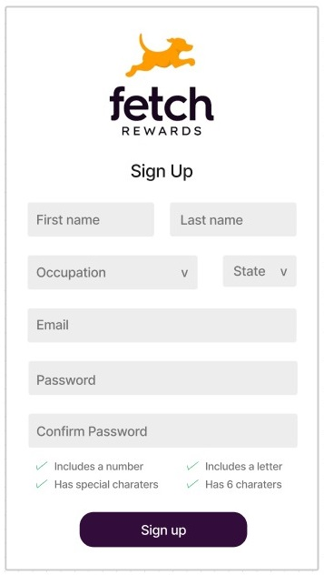
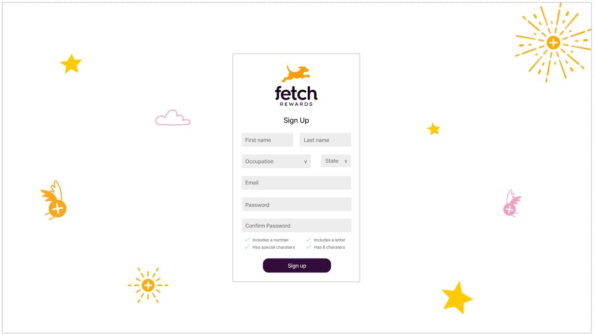
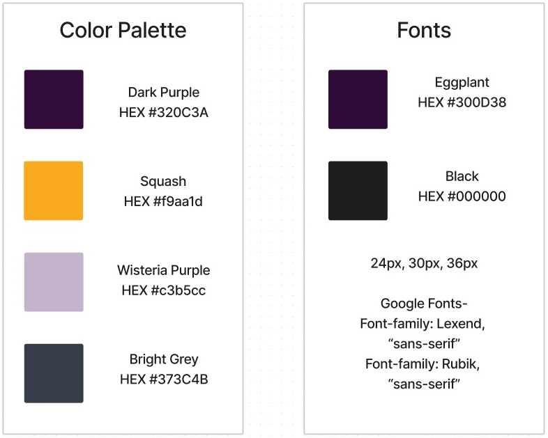

<div id="header" align="center">
  

  <h3>Frontend Take-Home Exercise</h3>

  ---
</div>

  ## Description:

  Your task is to build a webpage with a user creation form. The form should take the following required inputs:

  * Full Name
  * Email
  * Password 
  * Occupation
  * State
  
  Occupation and State should allow users to select from options returned by an endpoint. Users should only be able to select one occupation and one state. A GET request to https://frontend-take-home.fetchrewards.com/form will return a JSON body with the following format:

  ```{
    "occupations": [
        "occupation1",
        "occupation2",
        ...
    ],
    "states": [
        {
            "name": "Alabama",
            "abbreviation": "AL"
        },
        ...
    ]
}
```

You should submit the results of the form to the same endpoint (https://frontend-take-home.fetchrewards.com/form) via a POST request with a JSON body of the following format:

```
{
    "name": "???",
    "email": "???",
    "password": "???",
    "occupation": "???",
    "state": "???"
}
```

The POST endpoint will return a 201 status code if all fields are provided. The response body will be the created user object. It does not perform any validation beyond this.


## Table of Contents:

  * [Technologies Used](#technologies-used)
  * [Concept](#concept)
  * [Usage](#usage)
  * [Contact](#contact)

## Technologies Used

 <a target="_blank" rel="noopener noreferrer" href="https://vuejs.org/">
    
 </a>
 <a target="_blank" rel="noopener noreferrer" href="https://sass-lang.com/">
    
 </a>
 <a target="_blank" rel="noopener noreferrer" href="https://jestjs.io/docs/getting-started">
    
 </a>
 <a target="_blank" rel="noopener noreferrer" href="https://www.figma.com/">
    
 </a>

## Concept:

### Mobile Design



### Website Design



### Site Analysis


 

## Usage:

A user can sign up by filling in the input fields: First name, last name, occupation, state, email, and password; and cannot submit the form without completing the entire form. Occupation and State dropdown options are from returned endpoint GET request.

Form includes password validation feedback for password requirements and feedback on a successful submission POST request to the same endpoint.

## Contact:

### Brianna Woodruff  

briannaewoodruff@gmail.com

<a target="_blank" rel="noopener noreferrer" href="https://github.com/briannawoodruff">
    
</a>
<a target="_blank" rel="noopener noreferrer" href="https://www.linkedin.com/in/briannaewoodruff/">
    
</a>
<a target="_blank" rel="noopener noreferrer" href="https://www.linkedin.com/in/briannaewoodruff/">
    
</a>
